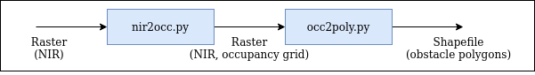
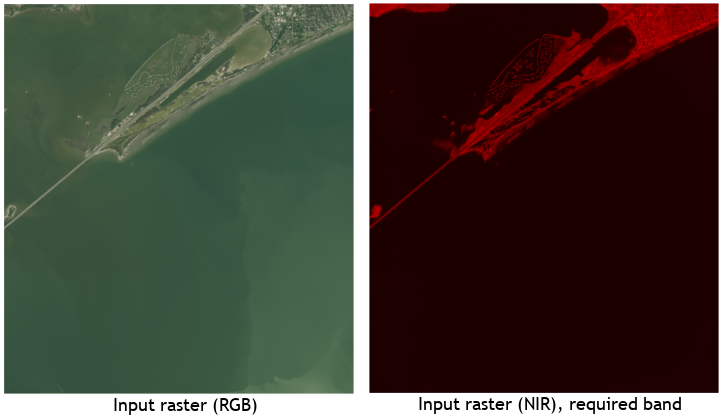
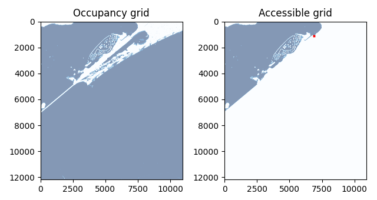
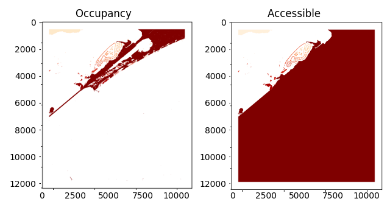

# nir2watermap

The Near-Infrared (NIR) band in aerial imagery is very useful for automatic segmentation of water and non-water pixels. Much inshore water is characterized by green tints that may be very difficult to separate from vegetation with RGB imagery. 

This can be exploited to generate raster or vector maps of obstacle regions for autonomous unmanned water surface vehicles. For example, an occupancy grid uses pixel values to state whether or not a pixel is free or occupied space. A vector could be used to generate polygons for "no-fly" zones, such as those used by the [ArduPilot](https://ardupilot.org/rover/docs/common-polygon_fence.html) autopilot software. At present, ArduPilot's polygons support a maximum of 70 vertices per mission, which is far below what is required for the complex island
and coastline shapes generated with these tools. 

### Pipeline

This repo has the tool `nir2occ.py` that converts a NIR band to occupancy grid, by copying the original raster and adding the occupancy grid as an additional band. 
If the user supplies a start location, then only water that is accessable from the start location is considered free space. 
This can reduce the complexity of grid-based planning algorithms by ignoring non-reachable cells. 
The other tool is `occ2poly.py` the converts a raster with an occupancy grid to a polygon ESRI shapegfile.
The shapes are areas inaccessible to a marine vehicle.

The input is a raster with a NIR band, such as this [Texas NAIP raster](https://data.tnris.org/collection/f1d66250-4021-47df-9fe9-9fca286b0f50) with R, G, B, and NIR bands. 

#### Input data

The input is a `.jp2` raster containing a Near-InfraRed (NIR) band. 

#### `nir2occ.py`

The following shows the occupancy grid when (left) no start point provided and (right) when a start point is provided.
Shades of blue indicate values that I am suspicious will be too shallow. 
To use as a binary occupancy grid, algorithms should consider a grayscale value of 255 as occupied and anything less as free. 

This region was purposely selected to highlight a shortcoming of the method; the "accessible regions" are divided by a bridge that a vessel would be able to traverse under. 

    # Print help for explanations of all options
    python3 nir2occ.py -h

    # Run without start point
    python3 nir2occ.py \
        --in_file in/naip18-nc-cir-60cm_2797141_20181210.jp2 \
        --out_file test_occ.jp2 \
        --out_file_plot test_occ.png \
        --bounds 27.849235,-97.361426,27.875268,-97.325000 \
        --band 4

    # Run with start point
    python3 nir2occ.py \
        --in_file in/naip18-nc-cir-60cm_2797141_20181210.jp2 \
        --out_file test_occ.jp2 \
        --out_file_plot test_occ.png \
        --bounds 27.849235,-97.361426,27.875268,-97.325000 \
        --band 4 \
        --start_coords 27.870539,-97.334531

#### `occ2poly.py`

The following shows the polygons when (left) no start point provided and (right) when a start point was provided when generating the occupancy grid.
Shades of yellow-orange simply denote discrete polygons. 

    # Run 
    python3 occ3poly.py \
        --in_file test_occ.jp2 \
        --out_file test_poly.shp \
        --out_file_plot test_poly.png \
        --band 5 

### Caveats

- Method does not guarantee a perfect occupancy grid. The quality is a function of image quality and potentially-misleading optical qualities.
- Method does not know the water depth, so your boat may not be able to traverse all free cells.
- Any non-water pixels will be assumed to be occupied. Notice in the examples above that the split between accessible areas is not correct, since the regions are intersected by a bridge which a vehicle could go under. Exploration-based robot behaviors could be used to drive down the uncertainty and improve the map. For example, the narrow strip is more likely a possible crossing than the large landmass.

### Test data source

[Texas NAIP Imagery source](https://data.tnris.org/collection/f1d66250-4021-47df-9fe9-9fca286b0f50)

        United States Department of Agriculture (USDA). Texas NAIP Imagery, 2018-12-31. Web. 2020-06-21.
